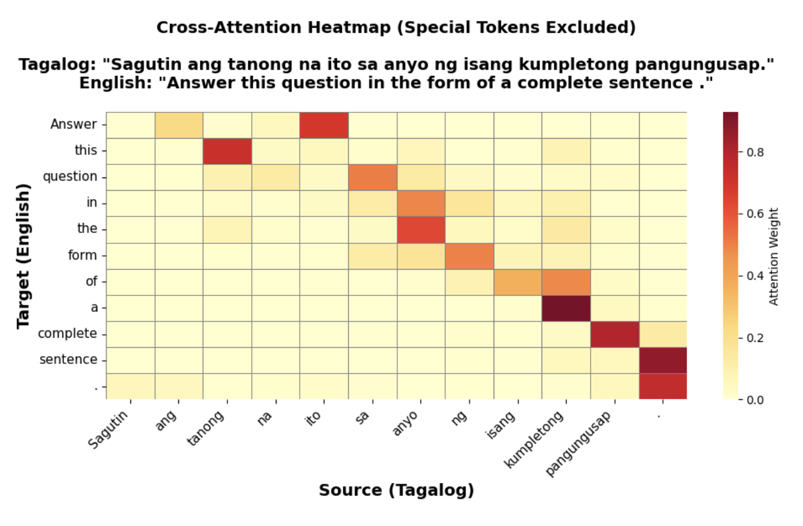

## Filipino–English BERT Translation Model

### 1. Overview

This project trains a BERT-style encoder–decoder for **Tagalog/Filipino → English** machine translation. The goal is to learn a single model from scratch on a public parallel corpus, evaluate it with BLEU, and inspect cross-attention to see how the model aligns source and target (including when Tagalog uses predicate-first *karaniwan* order). The notebook is intended to run on **Google Colab** with a GPU.

### 2. Methods

- **Data:** [rhyliieee/tagalog-filipino-english-translation](https://huggingface.co/datasets/rhyliieee/tagalog-filipino-english-translation) (Hugging Face `datasets`). Tagalog as source, English as target.
- **Tokenizer:** Custom BPE tokenizer trained on the combined train+test text (same vocab for both sides), then used to tokenize without padding at preprocess time; dynamic padding is applied in the data collator.
- **Model:** Hugging Face `EncoderDecoderModel` with a BERT encoder and BERT decoder (each 12 layers, 768 hidden size, 12 attention heads, 3072 intermediate size). Decoder has cross-attention over encoder outputs. Trained with `Seq2SeqTrainer`, cross-entropy on the decoder side.
- **Training:** 6 epochs, batch size 128 per device, Adam-style optimizer with warmup; evaluation and BLEU computed on the test set. No pre-trained weights—model is trained from scratch.
- **Analysis:** Cross-attention heatmaps (which source tokens each target token attends to) and discussion of *karaniwan* vs *di-karaniwan* word order and how it affects the attention pattern.

### 3. Key Results

- **BLEU:** Test BLEU ≈ **54** (sacrebleu, 0–100 scale). For a from-scratch model on a single GPU and a moderate-sized dataset, this indicates good n-gram overlap with references.
- **Training:** ~20 minutes for 80K+ examples on a Colab GPU (e.g. A100); training loss and eval loss behaved as expected without obvious overfitting in the reported setup.
- **Qualitative:** Sampled translations are coherent and often semantically close to references; the model handles mixed Tagalog–English and reordering (e.g. *karaniwan* sentences) reasonably. Some errors on specific examples (noted in the notebook).
- **Attention:** Cross-attention heatmaps show a “lagged” diagonal when source and target order align; for predicate-first Tagalog (e.g. *Tama ba ang pahayag?*), attention is more scattered as the model reorders into English.

  

### 4. How to Run

**Recommended: Google Colab (GPU).**

**Full run (train from scratch):**

1. Open the project repo and open **`notebooks/BERT_MODEL_TRAINING.ipynb`** in Colab (e.g. “Open in Colab” if the repo is set up for it, or upload/clone the repo and open the notebook from the `notebooks/` folder).
2. In Colab: **Runtime → Change runtime type → GPU** (e.g. T4 or better).
3. Run the notebook top to bottom. The first cell installs: `datasets`, `transformers`, `tokenizers`, `torch`, `accelerate`, `evaluate`, `sacrebleu`. Later cells mount Drive (if you want to save the model), load the dataset, train the tokenizer, preprocess, build the model, train, evaluate, and run translation + attention visualization.
4. Optional: To save the trained model, set your Drive path and use the “Save model” section; to load it later, use the “Load model later” section with the same path.
5. For attention heatmaps and BLEU, ensure the evaluation and “Analyzing Cross-Attention” sections are run after training (or after loading a saved model).

**For peer reviewers (load pretrained model, no training):**

You do **not** need to train the model or tokenizer. Training the tokenizer from scratch is possible if you want to reproduce the full pipeline, but **loading the trained model is recommended** so you can quickly run translation and attention visualization.

1. **Get the model artifacts:** Open the shared Google Drive folder and add it to your Drive (e.g. open the link → “Add to Drive” or copy the folder into your Drive):  
   **[filipino_english_model – Google Drive](https://drive.google.com/drive/folders/1jk6voLoebrpR4kcZkGbr7XcG0Jg0UaFJ?usp=sharing)**  
   The folder contains `config.json`, `tokenizer.json`, `tokenizer_config.json`, `model.safetensors`, `generation_config.json`, and related files.

2. Open **`notebooks/BERT_MODEL_TRAINING.ipynb`** in Colab and set **Runtime → Change runtime type → GPU**.

3. Run **Setup and Installation** (Section 1), then **Mounting Google Drive** (Section 2). After mounting, set the path in the notebook to the folder you copied (e.g. if the folder is in your Drive root: `/content/drive/MyDrive/filipino_english_model`). See the **“15. Load Model Later”** section for the exact variable to set.

4. Run the **“15. Load Model Later”** cell to load the model and tokenizer, then run **Test Translations** and **Analyzing Cross-Attention** (and any evaluation cells you want). You can skip tokenizer training, preprocessing, model creation, and training.

### 5. Requirements

Core dependencies (see `requirements.txt` for versions):

- `datasets` (load Hugging Face dataset)
- `tokenizers` (BPE training and encoding)
- `transformers` (BertConfig, BertModel, BertLMHeadModel, EncoderDecoderModel, Seq2SeqTrainer, tokenizer I/O)
- `torch`
- `accelerate` (used by the trainer)
- `evaluate`, `sacrebleu` (BLEU metric)
- `numpy`, `tqdm`, `requests` (utilities)

For the notebook as written (e.g. attention plots): `matplotlib`, `seaborn`. For TorchVista (architecture diagram): `torchvista`. Install in Colab with:

```bash
pip install datasets transformers tokenizers torch accelerate evaluate sacrebleu matplotlib seaborn
```

Optional: `pip install torchvista` if you want to regenerate the architecture visualization.

### 6. Model Architecture (Interactive Diagram)

An interactive view of the encoder–decoder layout (encoder vs decoder blocks, where encoder outputs feed into decoder cross-attention) was produced with **TorchVista** and saved as HTML. You can open it in a browser to expand/collapse modules and follow the data flow.

**View the diagram:** [**outputs/BERT_MODEL.html**](outputs/BERT_MODEL.html) (open in the repo or download and open in a browser).

## Peer Review Process

You'll be assigned two classmates' repositories to review. Provide your feedback through **pull requests**:

1. Clone your assigned classmate's repository to your machine
2. Read through their notebooks, scripts, and documentation
3. Try running the code yourself (for this repo, use **“For peer reviewers”** above—load the shared model from Drive instead of training)
4. Create a pull request with inline comments on their code/analysis
5. In the PR description, provide overall feedback addressing:
   - What worked well conceptually and technically?
   - What could be clearer in the documentation or analysis?
   - Specific suggestions for deeper analysis or improvements
   - Overall strengths of the project

Be constructive and specific. Good peer reviews identify both strengths and areas for growth.

You are *not* grading each other's pieces, just providing feedback.

## Timeline

- **Friday, Feb 20**: Portfolio piece due (push your final version to this repo)
- **Friday, Feb 27**: Peer reviews due (submit PRs with feedback to your assigned classmates' repos)

## Questions?

We can discuss more in class, in office hours, in discussion, and you can ask on Piazza.
